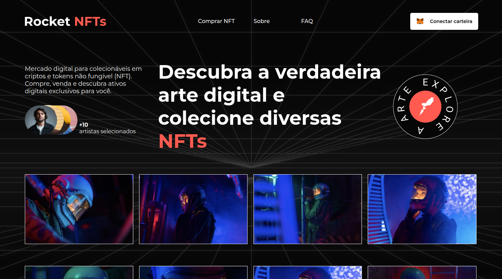
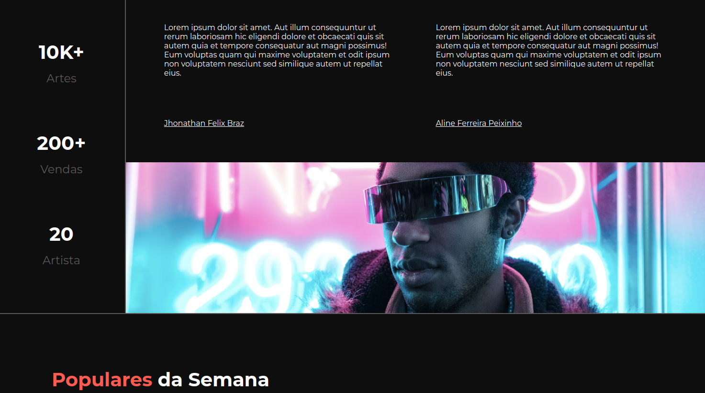
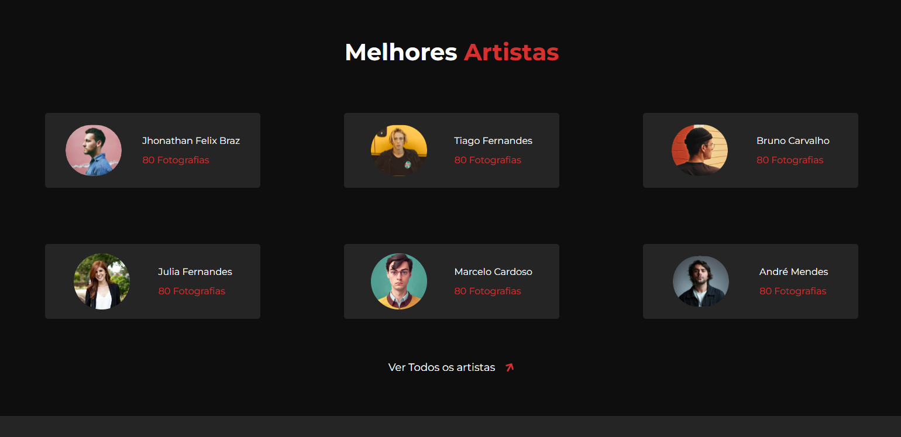

# 💻Projeto

<p align="center">

</p>

- RocketNFTs é um desafio/projeto Landing Page desenvolvido com ViteJs e esse projeto tem como objetivo de apresentar uma NFT fictícia.





# 📁 Acesso ao projeto

- 1º Baixe o projeto
- 2º Entre na pasta do Projeto
- 3º Rode um dos seguintes comandos

```bash
npm run dev
# or
yarn dev
# or
pnpm dev
```

# 🚀Tecnologias

Ferramentas Utilizadas:

<p>
    
</p>

Bibliotecas:

- React Icons
